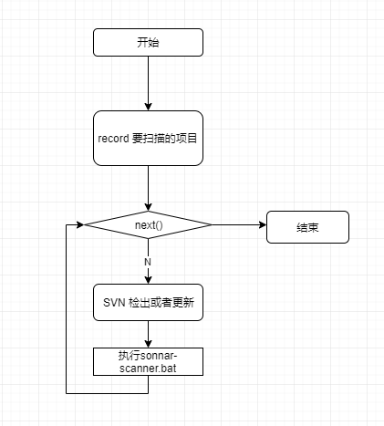

## 1.打包
maven:clean compile package ->repackage
## 2.linux文件夹路径
```java
void aa(){
    String osname = System.getProperty("os.name").toLowerCase();
    if(osname.indexOf("win")!=-1){
        System.out.println(osname);
        System.out.println("test.bat");
    }else{
        System.out.println("test.sh");
    }
}
```
## 3.其他的文档
### 1.流程是什么

### 要求什么
* 扫描项目需要sonar-scanner.properties
* 指定相关目录放置的代码,所有的代码将依次检出在这些文件夹中

### 瑕疵
1. 滚动条/下一页
2. sqlite会出现奇怪的错误
3. 密码明文,建议使用只读权限的账户
4. 

```
import 'ol/ol.css';
import Map from 'ol/Map';
import OSM from 'ol/source/OSM';
import Overlay from 'ol/Overlay';
import TileLayer from 'ol/layer/Tile';
import View from 'ol/View';
import {fromLonLat, toLonLat} from 'ol/proj';
import {toStringHDMS} from 'ol/coordinate';

var layer = new TileLayer({
  source: new OSM(),
});

var map = new Map({
  layers: [layer],
  target: 'map',
  view: new View({
    center: [0, 0],
    zoom: 2,
  }),
});

var pos = fromLonLat([16.3725, 48.208889]);

// Popup showing the position the user clicked
var popup = new Overlay({
  element: document.getElementById('popup'),
});
map.addOverlay(popup);

// Vienna marker
var marker = new Overlay({
  position: pos,
  positioning: 'center-center',
  element: document.getElementById('marker'),
  stopEvent: false,
});
map.addOverlay(marker);

// Vienna label
var vienna = new Overlay({
  position: pos,
  element: document.getElementById('vienna'),
});
map.addOverlay(vienna);

map.on('click', function (evt) {
  var element = popup.getElement();
  var coordinate = evt.coordinate;
  var hdms = toStringHDMS(toLonLat(coordinate));

  $(element).popover('dispose');
  popup.setPosition(coordinate);
  $(element).popover({
    container: element,
    placement: 'top',
    animation: false,
    html: true,
    content: '<p>The location you clicked was:</p><code>' + hdms + '</code>',
  });
  $(element).popover('show');
});
```

```
    async function handleClick(callback){
        var data =await fetch('/getData').then(res=>res.json());
        callback(data);
    }

    document.querySelector("#asexam").addEventListener('click',function(){
        let d=  handleClick(data=>{
            console.log(data)
        });
        console.log(d);
    })

```
